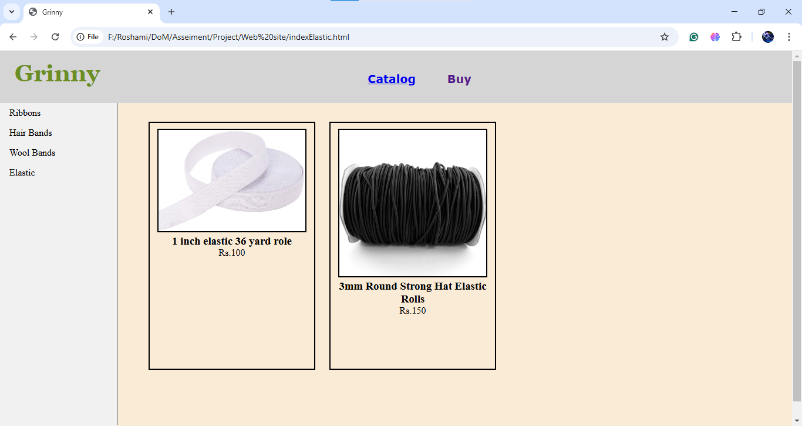
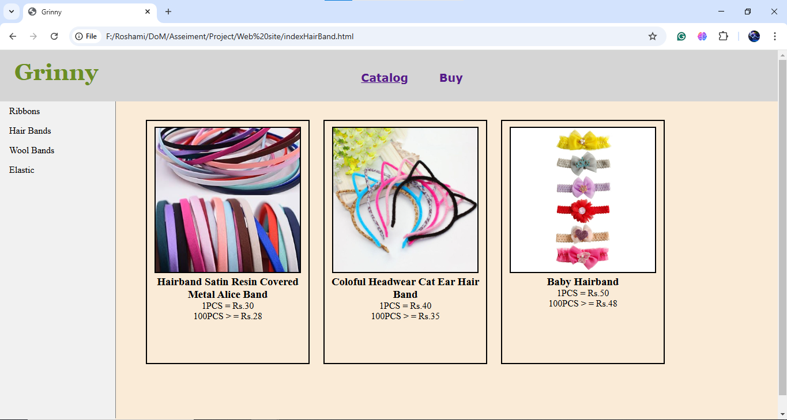
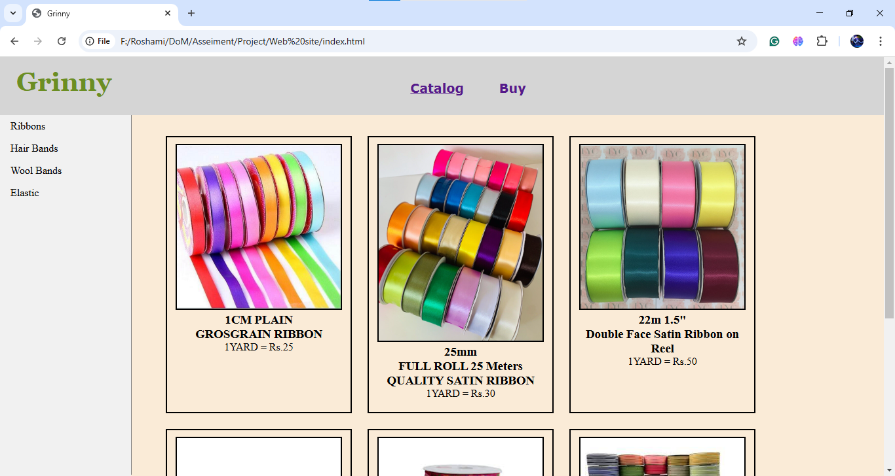
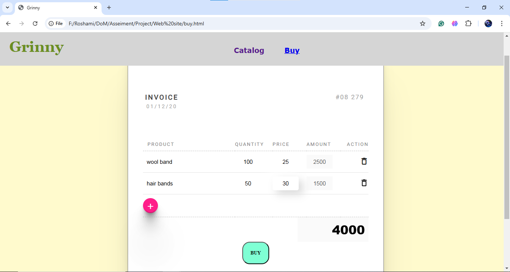

# Grinny - Hair Accessories Online Store 🛍️

This is a front-end web development project created as the **final assignment** for the **Front-End Web Development course** conducted by **Centre for Open & Distance Learning (CODL), University of Moratuwa**.

## 📌 Project Overview

Grinny is an online store that showcases various **hair accessories**, including:
- **Ribbons**
- **Hair Bands**
- **Wool Bands**
- **Elastics**

Users can view product images, prices, and place orders.

## 🖥️ Screenshots

### 📦 Product Listing







### 🛒 Order Section





## 🛠️ Technologies Used

This project was developed using:
- **HTML** – Structuring the web pages  
- **CSS** – Styling and layout  
- **JavaScript** – Enhancing interactivity  

## 🚀 Features

- Product categories with images and prices  
- User-friendly navigation  
- Simple and clean UI design  

## 📂 How to Run Locally

1. **Clone the repository:**
   ```bash
   git clone https://github.com/Roshami/Grinny-Online-Store.git

2. **Navigate to the project folder:**
   ```bash
   cd Grinny-Online-Store

3. **Open _index.html_ in a web browser.**

## 📜 License
This project is for educational purposes and is part of **the University of Moratuwa's CODL Front-End Web Development course**.

## ✨ Developed by Roshami Thashmantha. ✨
